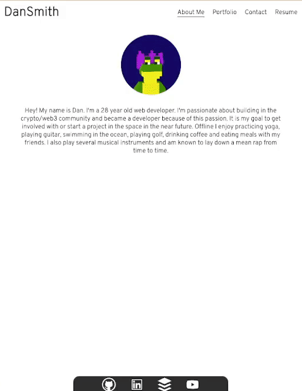

# Dan Smith Professional Portfolio - React 

**Description**
---

This single page application showcases some of my previous projects as a developer.

The 'About Me' section includes a brief blurb about myself as a developer and personally.

It also includes a 'Portfolio' section where users can view a range of different projects I have completed. There is a filter functionality that allows users to filter between front end, back end, full stack and web 3 projects.

The 'Contact' section allows users to input their name, email and a message for me. All these inputs are required and if users try to submit the form without filling all sections out or do not have a valid email in the email section, errors will show up. Also if a users mouse moves out of an input box without entering any text an error message will show.

The 'Resume' section has an embeded pdf of my professsional resume as well as a button to download the resume. Below the embeded resume it also lists my proficiencies and experience as a developer. 

The footer links to my GitHub, LinkedIn, StackOverFlow and YouTube pages if users wish to find out more about myself. 

**Live Website**
---

Link:
https://dansmith09.github.io/Dan-Smith-Professional-Portfolio/
